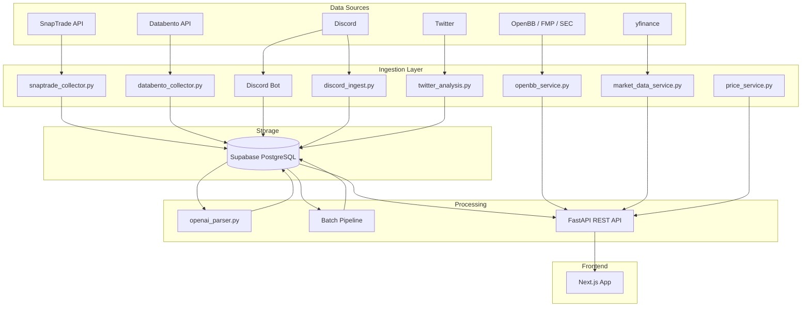

# LLM Portfolio Journal - Codebase Map

> **Last Updated:** March 1, 2026
> **Status:** Current — 20 core tables, migrations 060-066, Supabase PostgreSQL.

## 1. Project Overview

The **LLM Portfolio Journal** is a data-driven application that integrates brokerage data (SnapTrade), market information (Databento OHLCV), fundamental data (OpenBB/FMP/SEC), and social sentiment (Discord, Twitter) for trading analytics. The NLP pipeline uses OpenAI structured outputs to parse Discord messages into structured trading ideas. A Next.js frontend connects through FastAPI REST endpoints.

## 2. Directory Structure & Purpose

### `src/` - Core Application Logic

| Module/Directory | Purpose | Key Files |
| :--- | :--- | :--- |
| **`src/` (Root)** | Core services and utilities | `db.py`, `config.py`, `price_service.py`, `databento_collector.py`, `market_data_service.py`, `openbb_service.py`, `discord_ingest.py`, `retry_utils.py` |
| **`src/bot/`** | Discord Bot infrastructure | `bot.py` (entry), `events.py` (handlers), `commands/` (modular commands) |
| **`src/bot/ui/`** | Bot UI design system | `embed_factory.py`, `pagination.py`, `portfolio_view.py`, `portfolio_chart.py`, `logo_helper.py`, `symbol_resolver.py` |
| **`src/bot/formatting/`** | Output formatting | `orders_view.py` (OCC option parsing, order display) |
| **`src/nlp/`** | NLP parsing pipeline | `openai_parser.py`, `schemas.py`, `preclean.py`, `soft_splitter.py` |
| **`src/etl/`** | ETL pipelines | `sec_13f_parser.py` (standalone 13F analysis) |

### `app/` - FastAPI REST API

| Module | Purpose | Prefix |
| :--- | :--- | :--- |
| **`app/main.py`** | App factory, lifespan, CORS, router mounting | `/` |
| **`app/auth.py`** | Bearer token auth (`API_SECRET_KEY`) | — |
| **`app/routes/portfolio.py`** | Portfolio positions, sync, movers, sparklines | `/portfolio` |
| **`app/routes/orders.py`** | Order history with filters, notify | `/orders` |
| **`app/routes/stocks.py`** | Stock profile, ideas, OHLCV chart data | `/stocks` |
| **`app/routes/openbb.py`** | Transcripts, fundamentals, filings, news, notes | `/stocks` |
| **`app/routes/chat.py`** | AI stock chat (OpenAI) | `/stocks` |
| **`app/routes/search.py`** | Symbol search (DB → yfinance → OpenBB SEC) | `/search` |
| **`app/routes/watchlist.py`** | Watchlist prices, ticker validation | `/watchlist` |
| **`app/routes/ideas.py`** | Ideas CRUD, AI refine, context | `/ideas` |
| **`app/routes/activities.py`** | SnapTrade activity history | `/activities` |
| **`app/routes/connections.py`** | SnapTrade connection status, portal URL | `/connections` |
| **`app/routes/sentiment.py`** | Sentiment summary, messages | `/sentiment` |
| **`app/routes/webhook.py`** | SnapTrade webhook (HMAC verified) | `/webhook` |
| **`app/routes/debug.py`** | Symbol trace (opt-in via `DEBUG_ENDPOINTS=1`) | `/debug` |

### `scripts/` - Operational Utilities

| Script | Purpose | Status |
| :--- | :--- | :--- |
| **`nightly_pipeline.py`** | Orchestrates: OHLCV backfill → NLP batch → stock profiles | Active (systemd timer) |
| **`deploy_database.py`** | Deploy schema migrations to Supabase | Active |
| **`verify_database.py`** | Validates live DB schema against expected | Active |
| **`bootstrap.py`** | Automated local dev setup (deps, env, DB) | Active |
| **`backfill_ohlcv.py`** | Databento OHLCV backfill CLI | Active |
| **`backfill_activities.py`** | SnapTrade activity history backfill | Active |
| **`backfill_stock_profiles.py`** | Refresh stock_profile_current table | Active |
| **`validate_robinhood.py`** | Validate Robinhood CSV against DB | Active |
| **`ingest_discord.py`** | Incremental Discord message ingestion | Active |
| **`fetch_discord_history_improved.py`** | Historical Discord fetch with rate limiting | Active |
| **`snaptrade_notify.py`** | Discord webhook for new order notifications | Active |
| **`check_system_status.py`** | Quick health check for DB and APIs | Active |
| **`schema_parser.py`** | Generate `src/expected_schemas.py` from SQL | Active |
| **`env_doctor.py`** | Environment variable diagnostics | Active |
| **`fix_orphaned_accounts.py`** | Clean up orphaned account data | Active |
| **`investigate_symbol.py`** | Debug symbol data across all tables | Active |
| **`start_bot_with_secrets.py`** | AWS secrets → env → run Discord bot | Active (EC2) |

### `scripts/nlp/` - NLP Batch Pipeline

| Script | Purpose |
| :--- | :--- |
| **`parse_messages.py`** | Live message parsing with OpenAI structured outputs |
| **`build_batch.py`** | Build OpenAI Batch API request file |
| **`run_batch.py`** | Submit batch jobs to OpenAI |
| **`ingest_batch.py`** | Ingest batch results → `discord_parsed_ideas` |
| **`batch_backfill.py`** | Unified batch orchestrator (50% cost savings) |

### `schema/` - Database Migrations

SQL files defining the database structure. Applied via `deploy_database.py`.

- **Baseline**: `060_baseline_current.sql` — Complete 20-table schema for fresh installs
- **Migrations**: `061_cleanup` through `066_accounts_connection_status`
- **Archive**: `schema/archive/` — Retired migrations (000-059), kept for reference

### `tests/` - Test Suite

344 tests. CI runs on Python 3.11 and 3.12, skips `openai` and `integration` markers.

### `systemd/` - EC2 Services

| File | Type | Purpose |
| :--- | :--- | :--- |
| `api.service` | Long-running | FastAPI on 127.0.0.1:8000 (Nginx fronts) |
| `discord-bot.service` | Long-running | Discord bot via `start_bot_with_secrets.py` |
| `nightly-pipeline.service` | One-shot | Nightly data pipeline (30min timeout) |
| `nightly-pipeline.timer` | Timer | 1:00 AM daily ET |

## 3. Key Process Flows

### A. Data Ingestion Pipeline

1. **OHLCV Data**: `databento_collector.py` → Supabase `ohlcv_daily` table (equity-only; crypto excluded)
2. **Price Access**: `price_service.py` queries `ohlcv_daily` — sole source for OHLCV data
3. **Real-time Quotes**: `market_data_service.py` wraps yfinance with TTL caching
4. **Brokerage Data**: `snaptrade_collector.py` syncs positions, orders, accounts, balances
5. **Fundamentals**: `openbb_service.py` caches FMP/SEC data (transcripts, filings, news)
6. **Social Data**: Discord bot → `discord_messages`; Twitter → `twitter_data`
7. **Discord Ingest**: `discord_ingest.py` — cursor-based incremental ingestion with content hash dedup

### B. NLP Parsing Pipeline

1. **Trigger**: `scripts/nlp/parse_messages.py` (live) or batch pipeline
2. **Input**: Raw messages from `discord_messages`
3. **Processing**: OpenAI structured outputs (tiered: nano triage → mini parse → large escalation)
4. **Output**: Structured ideas in `discord_parsed_ideas`

### C. FastAPI → Next.js Frontend

1. **Backend**: FastAPI serves REST endpoints with Bearer token auth
2. **BFF Proxy**: Next.js API routes proxy to FastAPI, adding NextAuth session validation
3. **State**: SWR hooks for server state, Zustand for client state

## 4. Component Connections

## 5. Database Tables (20 Active)

| Category | Tables |
| :--- | :--- |
| **SnapTrade** | `accounts`, `account_balances`, `positions`, `orders`, `symbols`, `activities` |
| **Discord/NLP** | `discord_messages`, `discord_market_clean`, `discord_trading_clean`, `discord_parsed_ideas`, `discord_ingest_cursors` |
| **Ideas** | `user_ideas` |
| **Market Data** | `ohlcv_daily` (Databento) |
| **Stock Analytics** | `stock_profile_current`, `stock_profile_history`, `stock_notes` |
| **Twitter** | `twitter_data` |
| **System** | `processing_status`, `schema_migrations`, `symbol_aliases`, `institutional_holdings` |
