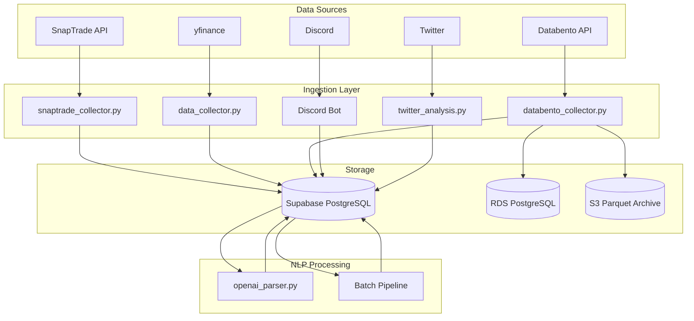

# LLM Portfolio Journal - Codebase Map & Architecture Guide

> **Generated on:** January 20, 2026
> **Status:** Up-to-date following January 2026 OHLCV pipeline (Databento integration, ohlcv_daily table).

## 1. Project Overview
The **LLM Portfolio Journal** is a data-driven application that integrates brokerage data (SnapTrade), market information (yfinance, Databento), and social sentiment (Discord, Twitter) for trading analytics. The NLP pipeline uses OpenAI structured outputs to parse Discord messages into structured trading ideas.

## 2. Directory Structure & Purpose

### `src/` - Core Application Logic
The heart of the application, organized by functional domain.

| Module/Directory | Purpose | Key Files |
| :--- | :--- | :--- |
| **`src/` (Root)** | Core services and utilities. | `db.py` (Database Engine), `config.py` (Settings), `data_collector.py` (Market Data), `databento_collector.py` (OHLCV). |
| **`src/bot/`** | Discord Bot infrastructure. | `bot.py` (Entry Point), `events.py` (Handlers), `commands/` (Modular commands like `chart`, `history`). |
| **`src/nlp/`** | NLP parsing pipeline. | `openai_parser.py` (LLM parser), `schemas.py` (Pydantic schemas), `preclean.py` (Ticker accuracy). |
| **`src/etl/`** | Extract-Transform-Load pipelines. | `sec_13f_parser.py` (Institutional holdings - Standalone). |

### `scripts/` - Operational Utilities
Scripts for deployment, maintenance, and manual operations.

| Script | Purpose | Status |
| :--- | :--- | :--- |
| **`deploy_database.py`** | Primary script for deploying schema changes to Supabase. | Active |
| **`bootstrap.py`** | Automated setup script (dependencies, env, DB check). | Active |
| **`verify_database.py`** | Validates live DB schema against `expected_schemas.py`. | Active |
| **`fetch_discord_history_improved.py`** | Fetches historical messages with rate limiting. | Active |
| **`check_system_status.py`** | Quick health check for DB and APIs. | Active |
| **`schema_parser.py`** | Generates `src/expected_schemas.py` from SQL files. | Active |
| **`backfill_ohlcv.py`** | Databento OHLCV backfill CLI for EC2. | Active |

### `scripts/nlp/` - NLP Pipeline Scripts
Active scripts for running the OpenAI-based NLP parsing pipeline.

| Script | Purpose | Status |
| :--- | :--- | :--- |
| **`parse_messages.py`** | Live message parsing with OpenAI structured outputs | Active |
| **`build_batch.py`** | Build batch API requests for bulk processing | Active |
| **`run_batch.py`** | Submit batch jobs to OpenAI API | Active |
| **`ingest_batch.py`** | Ingest batch results back to database | Active |
| **`batch_backfill.py`** | Unified orchestrator for complete batch pipeline | Active |

### `schema/` - Database Migrations
SQL files defining the database structure. Ordered by prefix (e.g., `000_`, `015_`).
*   **Source of Truth**: These files dictate the database state.
*   **Process**: Apply via `deploy_database.py`.
*   **Current**: 37 migration files (000_baseline through 050_ohlcv_daily)

### `src/nlp/` - NLP Processing Modules
The canonical NLP pipeline for parsing Discord messages into structured trading ideas.

| Module | Purpose | Status |
| :--- | :--- | :--- |
| **`openai_parser.py`** | LLM-based parsing with OpenAI structured outputs | Active (Canonical) |
| **`schemas.py`** | Pydantic schemas for ParsedIdea, MessageParseResult, 13 TradingLabels | Active |
| **`soft_splitter.py`** | Deterministic message chunking for long content | Active |
| **`preclean.py`** | Text preprocessing, ticker extraction, alias mapping, reserved word blocklist | Active |
| **`deprecated/`** | Legacy SetFit, chunking modules (backward compatibility) | Deprecated |

#### Ticker Accuracy System (preclean.py)

The NLP pipeline includes a multi-layer ticker accuracy system to prevent false positives:

1. **ALIAS_MAP** (~100 entries): Maps company names → ticker symbols
   - Specific variants only: `"target corp": "TGT"`, `"target store": "TGT"` (NOT bare "target")
   - Common aliases: `"nvidia": "NVDA"`, `"crowdstrike": "CRWD"`, `"google": "GOOGL"`

2. **RESERVED_SIGNAL_WORDS** (80+ terms): Trading terminology blocklist
   - Price targets: `tgt`, `pt`, `tp`, `target`, `price target`
   - Levels: `support`, `resistance`, `pivot`, `r1`, `r2`, `s1`, `s2`
   - Actions: `buy`, `sell`, `hold`, `trim`, `add`, `entry`, `exit`, `stop`
   - These words NEVER become tickers, even if they match a real symbol

3. **Key Functions**:
   - `extract_candidate_tickers(text)`: Deterministic ticker extraction before LLM
   - `validate_llm_tickers(llm_tickers, candidates)`: Post-validate LLM output against candidates
   - `is_reserved_signal_word(word)`: Check if word is trading terminology
   - `apply_alias_mapping(text, skip_reserved=True)`: Apply aliases while respecting blocklist

### `docs/` - Documentation
*   `ARCHITECTURE.md`: High-level system design.
*   `AGENTS.md`: Guide for AI contributors (canonical reference).
*   `CODEBASE_MAP.md`: This file - directory structure and purposes.
*   `SCHEMA_REPORT.md`: Detailed database schema with row counts.
*   `AI_ADVISOR_GUIDE.md`: Complete technical guide for AI coding assistants.

## 3. Key Process Flows

### A. Data Ingestion Pipeline
1.  **Market Data**: `data_collector.py` fetches prices via `yfinance`.
2.  **Brokerage Data**: `snaptrade_collector.py` syncs Positions, Orders, and Accounts from SnapTrade.
3.  **OHLCV Data**: `databento_collector.py` fetches daily OHLCV bars via Databento → RDS/S3/Supabase.
4.  **Social Data**:
    *   **Discord**: `src/bot/` listens to channels -> `message_cleaner.py` extracts Tickers/Sentiment -> DB (`discord_messages`).
    *   **Twitter**: `twitter_analysis.py` fetches tweets -> DB (`twitter_data`).

### B. NLP Parsing Pipeline
1.  **Trigger**: `scripts/nlp/parse_messages.py` (live) or batch pipeline (`build_batch.py` → `run_batch.py` → `ingest_batch.py`).
2.  **Input**: Raw messages from `discord_messages` table.
3.  **Processing**: OpenAI structured outputs extract trading ideas with labels, symbols, confidence levels.
4.  **Output**: Structured ideas stored in `discord_parsed_ideas` table.

### C. Database Management
*   **Engine**: `src/db.py` uses SQLAlchemy with a **PostgreSQL-only** configuration (Supabase).
*   **Connection**: Uses `SUPABASE_SERVICE_ROLE_KEY` to bypass RLS for backend operations.
*   **Validation**: `verify_database.py` ensures the live schema matches the code definitions.

## 4. Component Connections

## 5. Maintenance & Cleanup Notes
*   **Archived Scripts**: Legacy scripts have been permanently deleted (previously in `_archive/`).
*   **Deprecated NLP Modules**: Legacy SetFit/Argilla modules remain in `src/nlp/deprecated/` for backward compatibility but are NOT used in production.
*   **Active NLP Pipeline**: Uses OpenAI structured outputs (`src/nlp/openai_parser.py`) with parsed ideas stored in `discord_parsed_ideas` table.
*   **Standalone Tools**: `src/etl/sec_13f_parser.py` is a standalone tool for analyzing 13F filings and is not in the main automated pipeline.
