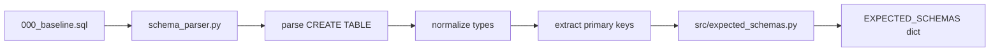

# EXPECTED_SCHEMAS Documentation

## Overview

`EXPECTED_SCHEMAS` is a standardized dictionary that defines the canonical database schema structure for validation and verification purposes throughout the LLM Portfolio Journal system.

## Structure Definition

```python
EXPECTED_SCHEMAS: Dict[str, Dict[str, Any]] = {
    "table_name": {
        "required_fields": Dict[str, str],  # field_name -> verification_type
        "primary_keys": List[str],          # list of primary key fields
        "description": str                  # human-readable description
    }
}
```

### Field Type Mapping

The verification types are normalized PostgreSQL types:

| PostgreSQL Type | EXPECTED_SCHEMAS Type | Description |
|-----------------|----------------------|-------------|
| `TEXT`, `VARCHAR`, `CHARACTER` | `"text"` | String data |
| `INTEGER`, `SERIAL`, `SMALLINT` | `"integer"` | Integer numbers |
| `BIGINT`, `BIGSERIAL` | `"bigint"` | Large integers |
| `NUMERIC`, `DECIMAL` | `"numeric"` | Precise decimal numbers |
| `BOOLEAN` | `"boolean"` | True/false values |
| `DATE` | `"date"` | Date only (no time) |
| `TIMESTAMP`, `TIMESTAMPTZ` | `"timestamp"` | Date and time |
| `TIME` | `"time"` | Time only |
| `JSON`, `JSONB` | `"json"` | JSON data |
| Array types (`[]`) | `"array"` | Array/list data |

## Generation Pipeline

### 1. Source of Truth (SSOT)
- **Primary Source**: `schema/000_baseline.sql`
- **Generator**: `scripts/schema_parser.py`
- **Command**: `make gen-schemas` or `python scripts/schema_parser.py --output expected`

### 2. Generation Process



1. **Parse DDL**: Extracts `CREATE TABLE` statements from `000_baseline.sql`
2. **Normalize Types**: Converts PostgreSQL types to standardized verification types
3. **Extract Keys**: Identifies primary key constraints from DDL
4. **Generate Code**: Writes Python dictionary to `src/expected_schemas.py`

### 3. Type Normalization Logic

```python
def _convert_to_verification_type(pg_type: str) -> str:
    """Convert PostgreSQL type to verification type."""
    # Timestamp normalization - both timestamp and timestamptz become 'timestamp'
    if pg_type.startswith("timestamp"):
        return "timestamp"
    
    # Numeric normalization
    if pg_type.startswith("numeric") or pg_type.startswith("decimal"):
        return "numeric"
    
    # Array handling
    if pg_type.endswith("[]") or pg_type.startswith("array"):
        return "array"
    
    # Standard mappings...
```

## Usage and Consumption

### 1. Database Verification (`scripts/verify_database.py`)

```python
from src.expected_schemas import EXPECTED_SCHEMAS

def verify_table_schema(table_name: str, live_schema: Dict) -> bool:
    """Verify live database schema matches expectations."""
    expected = EXPECTED_SCHEMAS.get(table_name)
    if not expected:
        logger.warning(f"No schema definition found for {table_name}")
        return False
    
    # Compare required_fields
    for field_name, expected_type in expected["required_fields"].items():
        if field_name not in live_schema:
            logger.error(f"Missing field {field_name} in {table_name}")
            return False
    
    return True
```

### 2. Schema Validation Patterns

```python
# Warn-only mode (recommended for production)
for table_name, schema_def in EXPECTED_SCHEMAS.items():
    if not verify_table_schema(table_name, live_schemas.get(table_name, {})):
        logger.warning(f"Schema mismatch in {table_name} - continuing anyway")
    # Don't exit on schema differences - just warn
```

### 3. Migration Verification

```python
def validate_migration_completeness():
    """Ensure all expected tables exist after migration."""
    for table_name in EXPECTED_SCHEMAS.keys():
        if not table_exists(table_name):
            raise MigrationError(f"Expected table {table_name} not found")
```

## Current Schema (Generated from 000_baseline.sql)

As of the latest generation, `EXPECTED_SCHEMAS` includes:

| Table Name | Fields | Primary Keys | Description |
|------------|--------|-------------|-------------|
| `accounts` | 9 | `[id]` | SnapTrade account information |
| `account_balances` | 8 | `[account_id, currency_code, snapshot_date]` | Account balance information |
| `positions` | 20 | `[symbol, account_id]` | SnapTrade position data |
| `orders` | 32 | `[brokerage_order_id]` | Trading orders with comprehensive tracking |
| `symbols` | 20 | `[id]` | Symbol metadata and trading information |
| `daily_prices` | 9 | `[symbol, date]` | Daily OHLCV price data |
| `realtime_prices` | 6 | `[symbol, timestamp]` | Real-time price updates |
| `stock_metrics` | 7 | `[date, symbol]` | Financial metrics and ratios |
| `discord_messages` | 16 | `[message_id]` | Discord message data with analysis |
| `discord_market_clean` | 7 | `[message_id]` | Cleaned market-related Discord messages |
| `discord_trading_clean` | 8 | `[message_id]` | Cleaned trading-related Discord messages |
| `discord_processing_log` | 5 | `[message_id, channel]` | Processing status for Discord messages |
| `processing_status` | 5 | `[message_id]` | Processing status tracking |
| `twitter_data` | 21 | `[tweet_id]` | Twitter/X data from Discord shared links |
| `chart_metadata` | 8 | `[symbol, period, interval, theme]` | Chart generation metadata |
| `schema_migrations` | 3 | `[version]` | Schema version tracking |

**Total**: 16 tables, 177 columns, 23 primary key fields

## Best Practices

### 1. Generation Frequency
- **When to regenerate**: After any changes to `schema/000_baseline.sql`
- **CI Integration**: Run `make gen-schemas` in build pipeline
- **Version Control**: Commit generated `src/expected_schemas.py` to track changes

### 2. Schema Validation Strategy
```python
# ✅ Recommended: Warn-only validation
def verify_database_schema():
    """Verify database schema with warn-only approach."""
    for table_name, expected_schema in EXPECTED_SCHEMAS.items():
        try:
            validate_table_schema(table_name, expected_schema)
        except SchemaValidationError as e:
            logger.warning(f"Schema validation warning for {table_name}: {e}")
            # Continue operation - don't fail on schema differences
    
    logger.info("Schema validation completed (warn-only mode)")
```

### 3. Error Handling
- **Missing Tables**: Log error but continue (allow partial deployments)
- **Extra Fields**: Ignore (forward compatibility)
- **Type Mismatches**: Warn only (PostgreSQL types may vary slightly)
- **Missing Fields**: Log warning (required for functionality)

## Troubleshooting

### Common Issues

1. **Generation Fails**
   ```bash
   # Check DDL syntax in baseline
   python -c "from scripts.schema_parser import main; main()"
   ```

2. **Validation Warnings**
   ```python
   # Check live schema vs expected
   from src.db import execute_sql
   result = execute_sql("SELECT column_name, data_type FROM information_schema.columns WHERE table_name = 'accounts'", fetch_results=True)
   ```

3. **Type Mapping Issues**
   - Review `_convert_to_verification_type()` in `schema_parser.py`
   - Add custom mappings for new PostgreSQL types

### Debugging Commands

```bash
# Regenerate schemas with verbose output
python scripts/schema_parser.py --output expected

# Verify current database state
python scripts/verify_database.py

# Check baseline DDL syntax
python -c "from pathlib import Path; print(Path('schema/000_baseline.sql').read_text()[:1000])"
```

## Related Files

- **Generator**: `scripts/schema_parser.py` 
- **Output**: `src/expected_schemas.py`
- **Consumer**: `scripts/verify_database.py`
- **Source**: `schema/000_baseline.sql`
- **Makefile**: `make gen-schemas` target
- **Documentation**: This file (`docs/EXPECTED_SCHEMAS.md`)